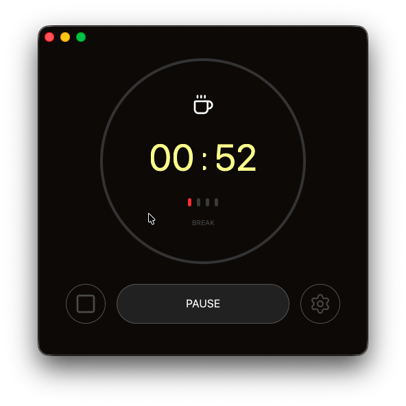

# BMO - Pomodoro Timer

> Name's inspired by BMO from Adventure Time.



A minimal, GPU-accelerated Pomodoro timer built with Rust and GPUI. Named after the friendly little robot from Adventure Time who's always ready to help you stay focused!

## ⚠️ Work in Progress

This project is actively being developed. Features may be incomplete, and the API may change. Feel free to contribute or report issues!

## Features

### Currently Implemented

- **Focus & Break Timer**: Toggle between focus sessions and breaks with visual indicators
- **Session Tracking**: Visual progress indicators showing completed focus sessions (default: 4 sessions)
- **Timer Controls**:
  - Start/Pause/Continue functionality
  - Stop button (currently being improved)
- **Beautiful UI**: Dark-themed interface with custom SVG icons
- **Real-time Updates**: Live countdown timer with smooth updates

### TODO

- **Settings Menu**: Customize focus duration, break duration, and session count (settings button UI exists but needs implementation)
- **Notifications**: Alerts when focus sessions or breaks complete
- **Persistent Settings**: Save preferences across app restarts
- **Sound Effects**: Optional audio cues for session transitions

## Installation

```bash
# Clone the repository
git clone https://github.com/rubbiekelvin/bmo.git
cd bmo

# Build and run
cargo run
```

## Building

```bash
# Debug build
cargo build

# Release build
cargo build --release
```
